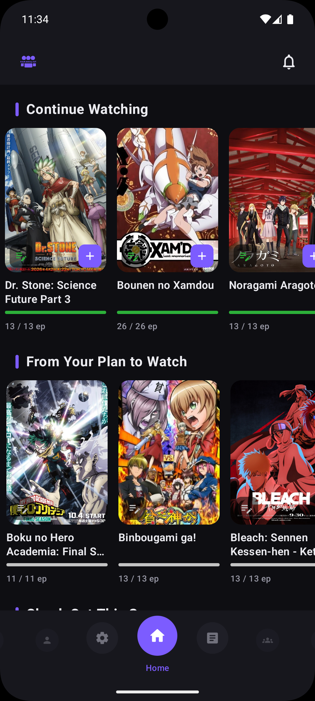
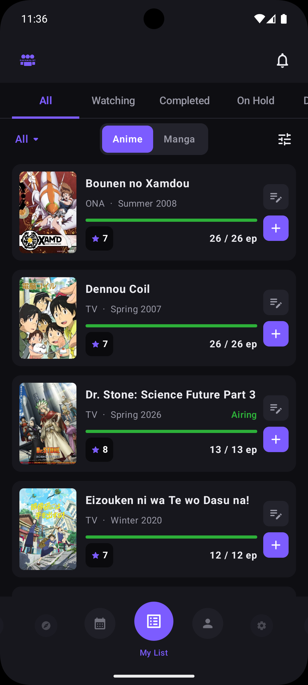
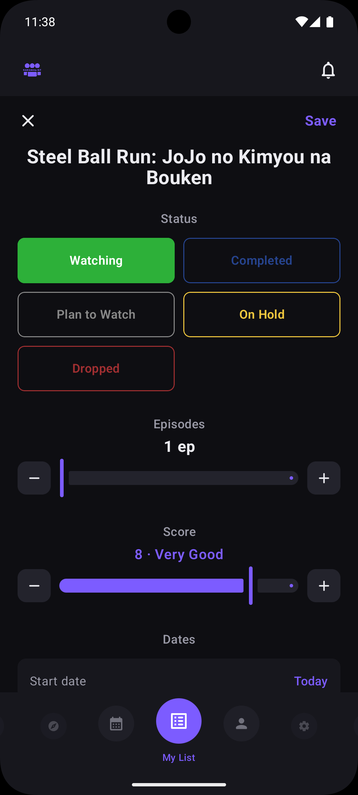
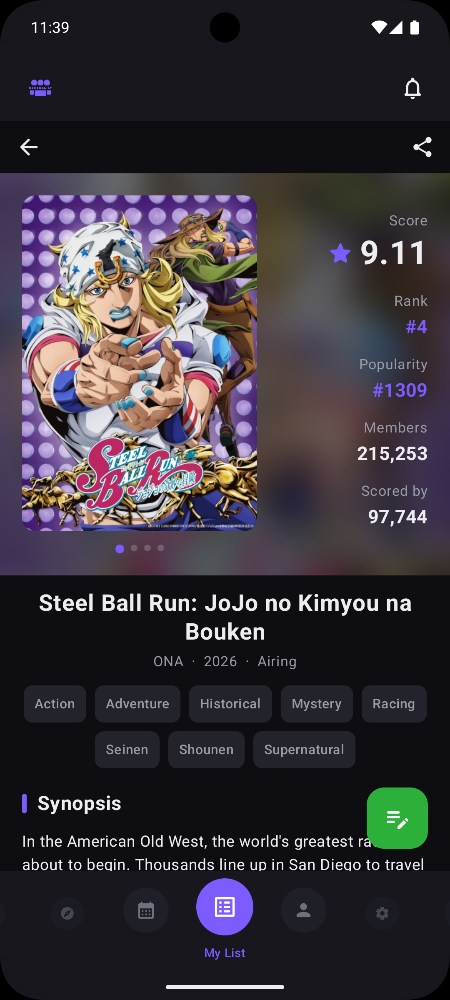
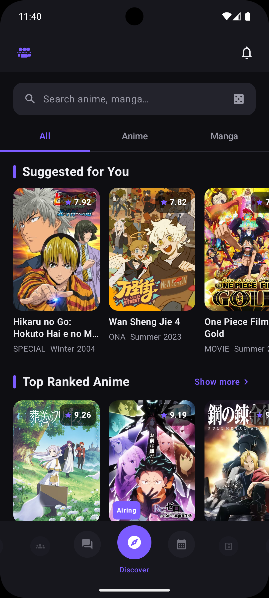
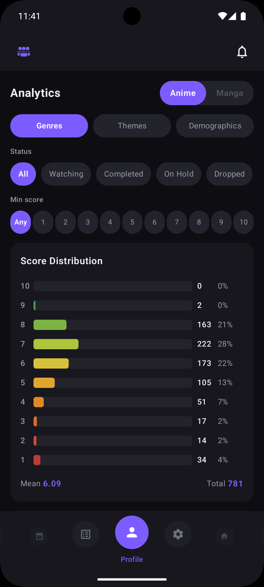
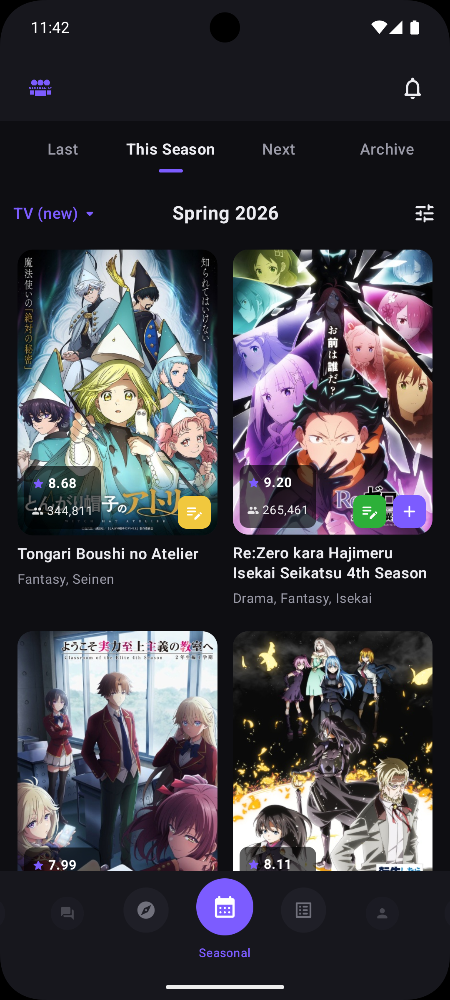
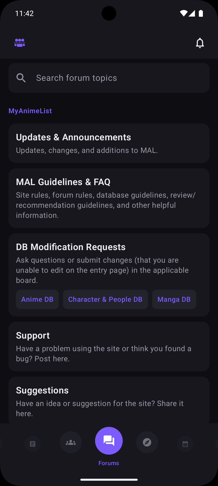

  

  # NakamaList

  **An unofficial, mobile-first MyAnimeList client for anime and manga.**

  Manage your anime and manga lists and follow the community (news, forums, clubs), in 56 languages.

  
  
  
  

> [!NOTE]
> **Not affiliated with MyAnimeList.** NakamaList is an independent, unofficial client. Sign-in and all
> reading and writing happen through the official MyAnimeList API with your own account.

## Screenshots

  
  
  
  
   
  
  
  
  

## Features

Sign in with MyAnimeList and get:

* **Your list, fully editable** - status, score, episode/chapter progress, volumes, dates, rewatch/reread,
  priority, tags and comments, with a quick "+1" and instant updates.
* **A personalized Home** - Continue Watching and Reading, New Episodes, Plan-to-Watch/Read, and this season.
* **Discover** - every official ranking, Top Ranked Anime/Manga, Suggested-for-You, full-screen search, and
  a random pick.
* **Rich detail pages** - synopsis, score and rank, related and recommended, characters and staff with
  people pages, the trailer, opening/ending themes, status bars, discussions, and Share.
* **Your profile** - full anime and manga statistics plus on-device analytics.
* **Seasonal** - browse every season back to 1917.
* **News and community** - MyAnimeList news with an in-app reader, read-only Forums, and a Clubs browser.
* **Notifications** - airing reminders and list-news in a bell feed.
* **AniList (optional)** - read community reviews and keep your MyAnimeList and AniList lists in sync.
* **For everyone** - 56 languages (with right-to-left), light/dark/white themes, an accent palette, swipe
  "revolver" navigation, and home-screen Continue widgets.

Privacy-first: no ads, no third-party analytics or tracking. Your sign-in is stored encrypted on your
device. A mature-content (NSFW) toggle is off by default.

## Download

> _Coming soon to Google Play._

## Languages

NakamaList is available in **56 languages**, including right-to-left support for Arabic, Hebrew, Persian and
Urdu. The primary language is English, with Turkish as a first-class localization. Change it any time in
Settings.

## Privacy and Terms

* [Privacy Policy](PRIVACY_POLICY.md)
* [Terms of Use](TERMS_OF_USE.md)
* [Changelog](CHANGELOG.md)

## Support

If you would like to support development, use the **Sponsor** button at the top of this page (see
[`FUNDING.yml`](FUNDING.yml)). It is entirely optional and always appreciated.

## Legal

NakamaList is an independent project. It is **not** affiliated with, endorsed by, or officially connected to
MyAnimeList, AniList, or any related company. All trademarks and product names belong to their respective
owners.

## License

Copyright (c) 2026 Ahmet Salih Golen. All rights reserved. The NakamaList name, brand assets, and
documentation are proprietary; no license to reuse them is granted.

## Maintainer

Created and maintained by **Ahmet Salih Golen**, [github.com/asa07-salihg](https://github.com/asa07-salihg)
