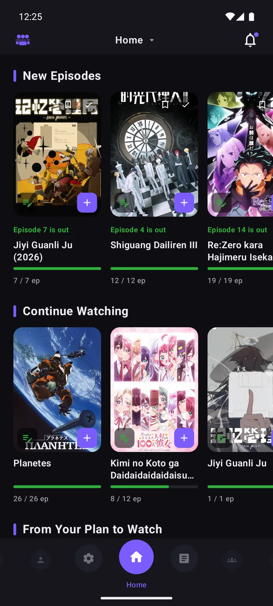
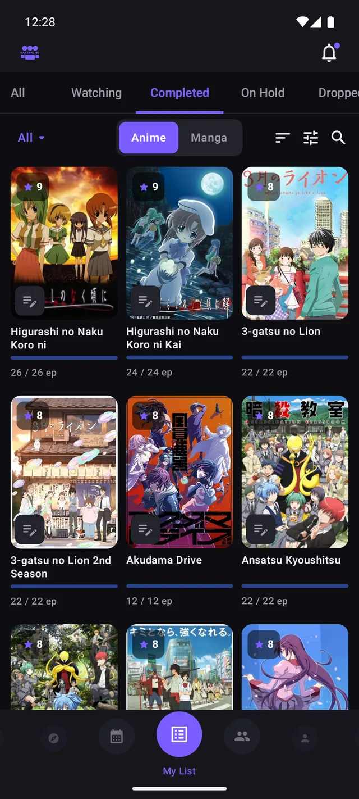
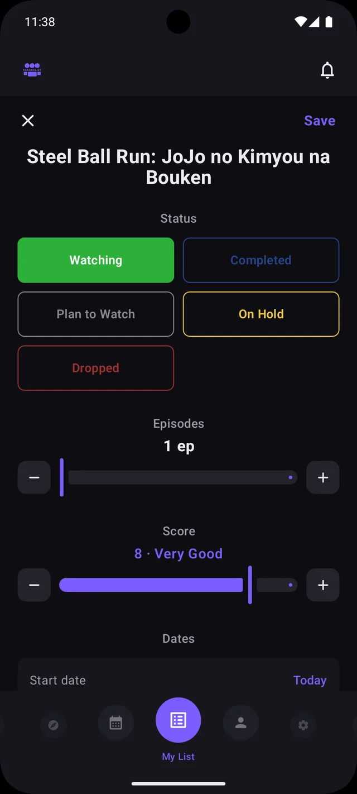
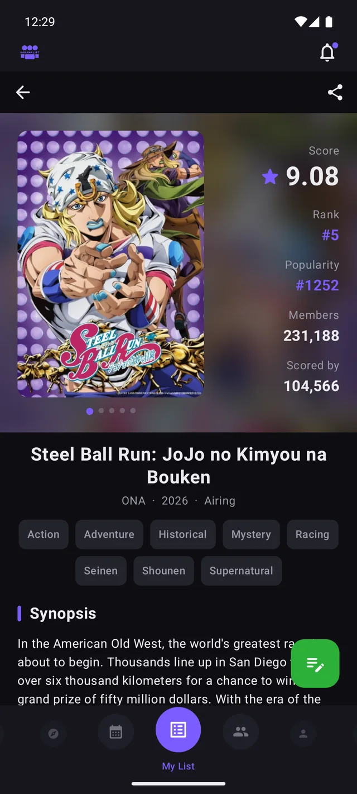
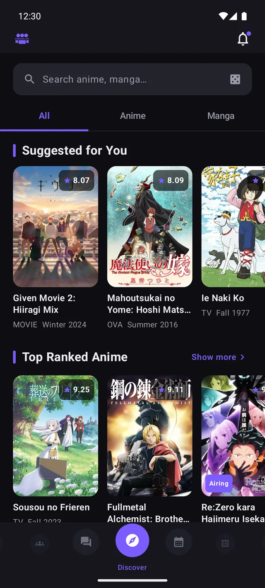
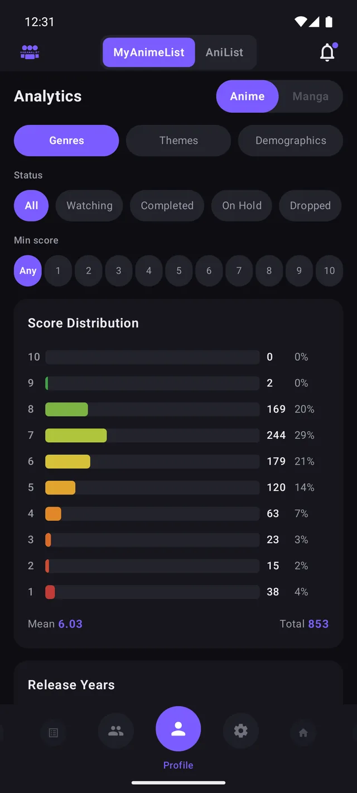
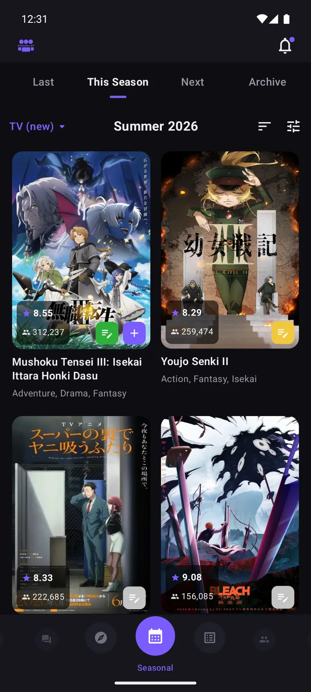
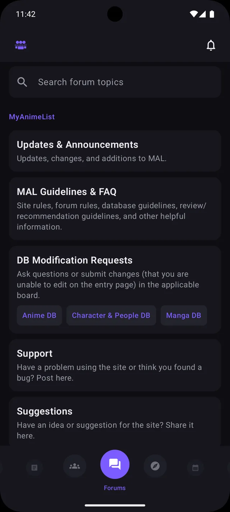

  

  # NakamaList

  **An unofficial, mobile-first MyAnimeList and AniList client for anime and manga.**

  Track your lists, follow your friends, and keep up with the community - on your phone, tablet and TV,
  in 56 languages.

  
  
  
  

> [!NOTE]
> **Not affiliated with MyAnimeList or AniList.** NakamaList is an independent, unofficial client.
> Sign-in and all reading and writing happen through those services' official APIs, with your own
> account and only your own data.

## Screenshots

  
  
  
  
   
  
  
  
  

## Features

Sign in with **MyAnimeList or AniList** - either one works on its own, and linking both unlocks sync.

### Your lists

* **Fully editable** - status, score, episode/chapter progress, volumes, dates, rewatch/reread,
  priority, tags and comments, with a quick "+1". Edits are instant and show up everywhere at once.
* **Your way** - list or poster-grid layout, status tabs, type filters and sorts, your preferred score
  scale (100-point, 10-point decimal, 5 stars, smileys...) and titles in romaji or English.
* **A personalized Home** - Continue Watching and Reading, New Episodes, Plan-to-Watch/Read, this season,
  and your own Recent Activity across anime, episodes, manga and chapters.

### Friends

* **Add people** by MyAnimeList username, or follow AniList accounts - both sets side by side.
* **Recent Activity** - everyone you follow in one merged feed, newest first, swipeable across
  All / Anime / Episodes / Manga / Chapters.
* **Their lists** - browse a friend's anime and manga on the same screen as your own, with the same
  tabs, toolbar and layout.
* **Friend Scores** on every title page - what each person gave it, your score alongside, and their
  average.
* **Export and Import** your friends list, so a new phone or a reinstall costs nothing.

### Discover and community

* **Discover** - every official ranking, Top Ranked Anime/Manga, Suggested-for-You, full-screen search,
  and a random pick.
* **Rich detail pages** - synopsis, score and rank, related and recommended, characters and staff with
  people pages, the trailer, opening/ending themes, status bars, discussions, and Share.
* **Seasonal** - browse every season back to 1917.
* **News and community** - MyAnimeList news with an in-app reader, read-only Forums, and a Clubs browser.
* **Your profile** - full anime and manga statistics plus on-device analytics.
* **Notifications** - airing reminders and news about your list, in a bookmarkable bell feed.

### Everywhere, for everyone

* **Phone, tablet and TV** - Android TV and Google TV with full remote control, and tablets that fill
  the screen instead of a portrait strip.
* **56 languages**, including right-to-left (Arabic, Hebrew, Persian, Urdu).
* Light, dark and white themes, an accent colour dial, swipe **"revolver"** navigation you can reorder,
  and home-screen **Continue** widgets.
* **MAL <-> AniList sync** when both are linked: a previewed one-way apply, plus automatic write-through
  so an edit on one side lands on the other.

Privacy-first: no ads, no third-party analytics or tracking. Your sign-in is encrypted on your device
with a key that never leaves it. A mature-content (NSFW) toggle is off by default.

## Download

## Requirements

Android 8.0 (API 26) or newer. Also runs on Android tablets, and on Android TV / Google TV, where it
appears in the launcher with its own banner and is fully navigable by remote.

## Languages

NakamaList is available in **56 languages**, including right-to-left support for Arabic, Hebrew, Persian and
Urdu. The primary language is English, with Turkish as a first-class localization. Change it any time in
Settings.

## Privacy and Terms

* [Privacy Policy](PRIVACY_POLICY.md)
* [Terms of Use](TERMS_OF_USE.md)
* [Changelog](CHANGELOG.md)

## Support

If you would like to support development, use the **Sponsor** button at the top of this page (see
[`FUNDING.yml`](FUNDING.yml)). It is entirely optional and always appreciated.

## Legal

NakamaList is an independent project. It is **not** affiliated with, endorsed by, or officially connected to
MyAnimeList, AniList, or any related company. All trademarks and product names belong to their respective
owners.

## License

Copyright (c) 2026 Ahmet Salih Golen. All rights reserved. The NakamaList name, brand assets, and
documentation are proprietary; no license to reuse them is granted.

## Maintainer

Created and maintained by **Ahmet Salih Golen**, [github.com/asa07-salihg](https://github.com/asa07-salihg)
