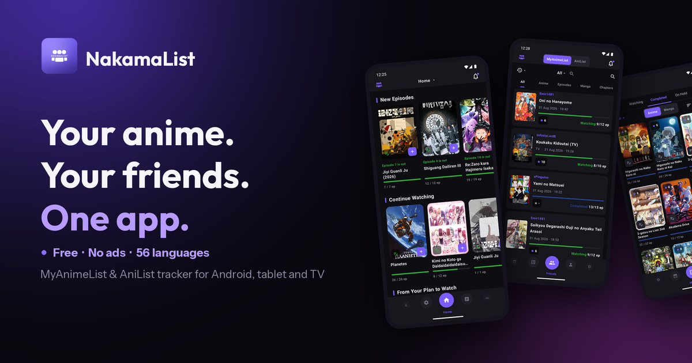
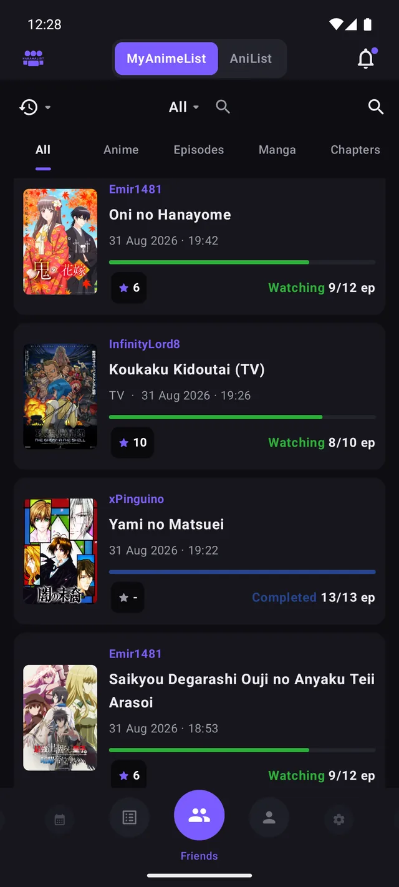
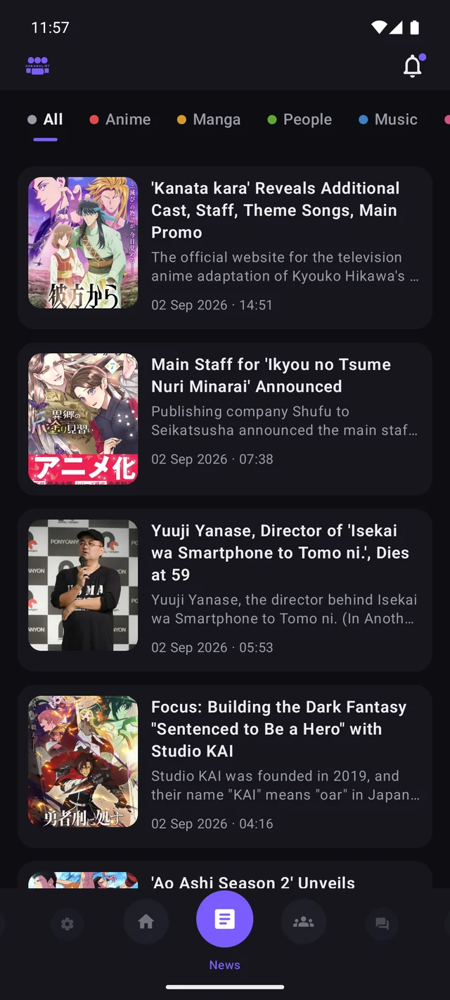
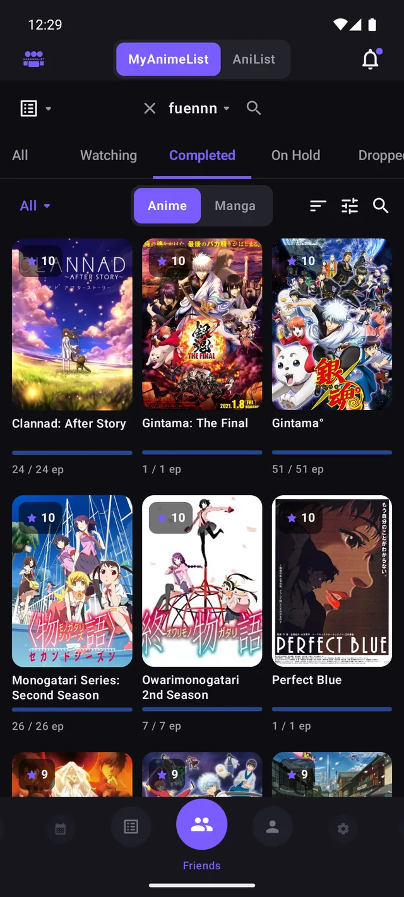
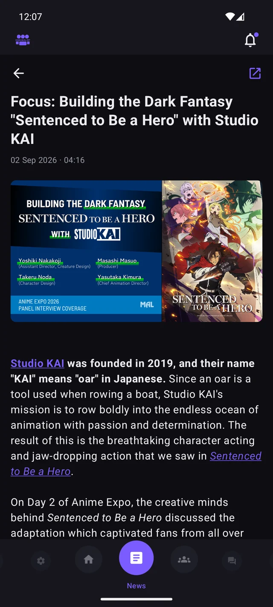
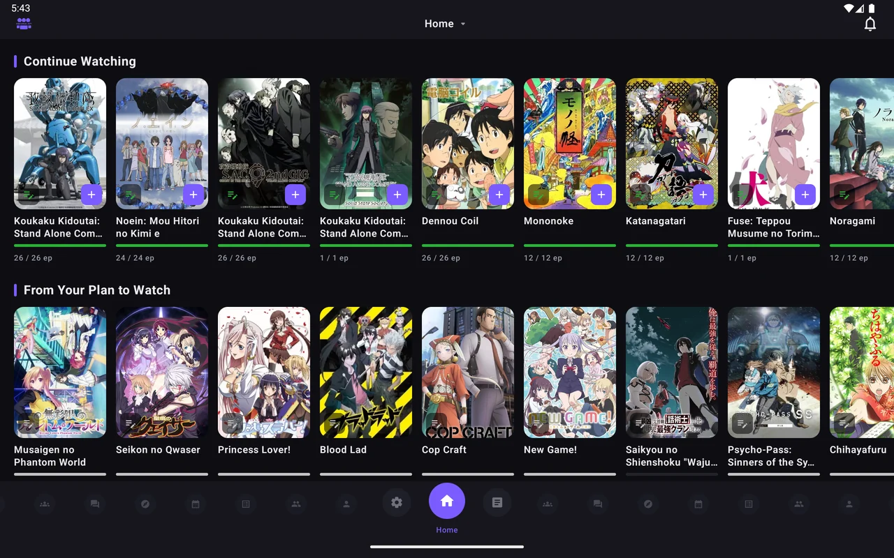
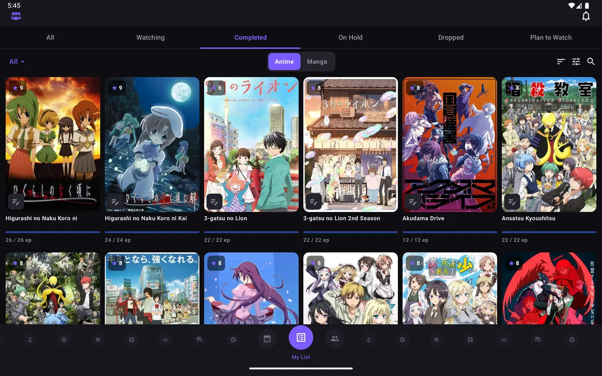

 

**An unofficial, mobile-first MyAnimeList client for anime and manga.**

Track your lists, follow your friends, and keep up with the community, 
on your phone, tablet and TV, in 56 languages.

 

 

[Website](https://asa07-salihg.github.io/NakamaList/)&nbsp;&nbsp;·&nbsp;&nbsp;[Screenshots](#screenshots)&nbsp;&nbsp;·&nbsp;&nbsp;[Features](#features)&nbsp;&nbsp;·&nbsp;&nbsp;[Download](#download)&nbsp;&nbsp;·&nbsp;&nbsp;[Support](#support)

> [!NOTE]
> **Not affiliated with MyAnimeList or AniList.** NakamaList is an independent, unofficial client.
> Sign-in and all reading and writing happen through those services' official APIs, with your own
> account and only your own data.

## Screenshots

  
  
  
  
  
   
  
  
  
  
  
    
  
  
   
  <b>On a tablet it fills the screen</b> - not a portrait strip stretched sideways.

## Features

Sign in with **MyAnimeList or AniList** - either one works on its own, and linking both unlocks sync.

- **Everything is editable** - status, score, progress, volumes, dates, rewatches, priority, tags, notes, and a one-tap `+1`
- **One feed for everyone** - friends from MyAnimeList and AniList, merged, newest first
- **Friend Scores** - what each person gave a title, next to your own, on every page
- **Discover** - official rankings, Suggested-for-You, search, and a random pick
- **Seasonal** - every anime season, sortable, with Plan to Watch straight from the grid
- **News, forums and clubs** - read inside the app, not in a browser tab
- **Phone, tablet and TV** - real tablet layouts; Android TV and Google TV by remote
- **56 languages** - including right-to-left: Arabic, Hebrew, Persian, Urdu
- **Private by design** - no ads, no third-party analytics, no tracking

### Your lists

**Fully editable.** Status, score, episode and chapter progress, volumes, dates, rewatch and reread
counts, priority, tags and comments - with a one-tap **+1**. Edits are instant and show up
everywhere at once.

**Your way.** List or poster-grid layout, status tabs, type filters and sorts, your preferred score
scale (100-point, 10-point decimal, 5 stars, smileys) and titles in romaji or English.

**A personalized Home.** Continue Watching and Reading, New Episodes, Plan-to-Watch and Plan-to-Read,
this season, and your own Recent Activity across anime, episodes, manga and chapters.

### Friends

**Add people** by MyAnimeList username, or follow AniList accounts - both sets side by side.

**Recent Activity.** Everyone you follow in one merged feed, newest first, swipeable across
All, Anime, Episodes, Manga and Chapters.

**Their lists.** Browse a friend's anime and manga on the same screen as your own, with the same
tabs, toolbar and layout.

**Friend Scores** on every title page - what each person gave it, your score alongside, and their
average.

**Export and Import** your friends list, so a new phone or a reinstall costs nothing.

### Discover and community

**Discover.** Every official ranking, Top Ranked Anime and Manga, Suggested-for-You, full-screen
search, and a random pick.

**Rich title pages.** Synopsis, score and rank, related and recommended titles, characters and staff
with their own pages, the trailer, opening and ending themes, status bars, per-episode discussions,
and Share.

**Seasonal.** Browse every anime season, sorted the way you want.

**News and community.** MyAnimeList news with an in-app reader, read-only Forums, and a Clubs browser.

**Notifications.** Airing reminders and news about your list, in a bookmarkable bell feed.

### Everywhere, for everyone

**Phone, tablet and TV.** Android TV and Google TV with full remote control, and tablets that fill
the screen instead of stretching a portrait layout sideways.

**56 languages**, including right-to-left support for Arabic, Hebrew, Persian and Urdu.

**Make it yours.** Light, dark and white themes, an accent colour dial, swipe *revolver* navigation
you can reorder, and home-screen **Continue** widgets.

**MAL and AniList sync** when both are linked: a previewed one-way apply, plus automatic
write-through so an edit on one side lands on the other.

> [!IMPORTANT]
> **Privacy-first.** No ads, no third-party analytics, no tracking. Your sign-in is encrypted on your
> device with a key that never leaves it. A mature-content (NSFW) toggle is off by default.

## Download

*Free. No account needed to browse - sign in only when you want to track.*

### Requirements

- **Android** 8.0 (API 26) or newer
- **Phones** in portrait and landscape
- **Tablets** with multi-pane layouts that use the full screen
- **TV** on Android TV and Google TV, with its own launcher banner and full remote navigation
- **Account** on MyAnimeList or AniList to track; browsing works without one

### Languages

NakamaList is available in **56 languages**, including right-to-left support for Arabic, Hebrew,
Persian and Urdu. The primary language is English, with Turkish as a first-class localization.
Change it any time in Settings.

## Support

- **Found a bug?** [Report it](https://github.com/asa07-salihg/NakamaList/issues/new?template=bug_report.md) - the template asks for the device, Android version and steps
- **Want a feature?** [Suggest it](https://github.com/asa07-salihg/NakamaList/issues/new?template=feature_request.md)
- **Anything else?** [nakamalist@proton.me](mailto:nakamalist@proton.me)

If you would like to support development, use the **Sponsor** button at the top of this page
(see [`FUNDING.yml`](FUNDING.yml)). It is entirely optional and always appreciated.

## Privacy and Terms

[Privacy Policy](PRIVACY_POLICY.md) · [Terms of Use](TERMS_OF_USE.md) · [Changelog](CHANGELOG.md)

## Legal

NakamaList is an independent project. It is **not** affiliated with, endorsed by, or officially
connected to MyAnimeList, AniList, or any related company. All trademarks and product names belong
to their respective owners.

## License

Copyright © 2026 Ahmet Salih Golen. All rights reserved. The NakamaList name, brand assets, and
documentation are proprietary; no license to reuse them is granted.

---

Built and maintained by <b>Ahmet Salih Golen</b> · <a href="https://github.com/asa07-salihg">@asa07-salihg</a>

<table><td>
<a href="#start-of-content">Back to top</a>
</td></table>

